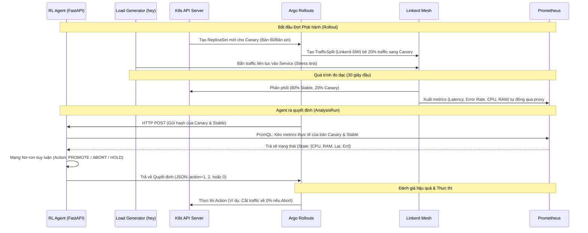

# K8s RL Canary Agent (Linkerd & SMI)

Kho lưu trữ này chứa một môi trường Sandbox "Digital Twin" chuyên dụng, được thiết kế để huấn luyện và vận hành một Tác tử Học tăng cường (Reinforcement Learning - TransformerPPO) làm nhiệm vụ quản lý quá trình phát hành Canary trên Kubernetes một cách tự động và an toàn.

Kiến trúc này tận dụng **Cilium (CNI)** làm lớp mạng cơ sở, **Linkerd Service Mesh** để định tuyến luồng traffic L7 và thu thập metrics (thông qua linkerd-viz proxy), và **Argo Rollouts** kết hợp với **Linkerd-SMI** để quản lý vòng đời và điều hướng traffic cho bản Canary.

---

## 🏗 System Architecture (Kiến trúc hệ thống)

Hệ thống hoạt động dưới 2 chế độ riêng biệt: **Huấn luyện (External Controller)** và **Vận hành thực tế (Native GitOps Webhook)**. Dưới đây là sơ đồ luồng hoạt động tổng quát:



---

## 🚀 Hướng dẫn Triển khai (Step-by-Step)

Hãy làm theo các bước dưới đây để tái tạo lại chính xác kiến trúc on-premise này từ con số 0.

### 1. Chuẩn bị OS và Cài đặt K8s (Kubeadm) + Cilium CNI

Trước khi khởi tạo cụm, ta cần chuẩn bị OS (Ubuntu/Debian/WSL) bằng cách tắt Swap, nạp kernel modules và cài đặt `containerd`, `kubelet`, `kubeadm`, `kubectl`. Khởi tạo cụm K8s nhưng **bỏ qua** cài đặt Kube-proxy mặc định để Cilium eBPF thay thế hoàn toàn.

```bash
# 1. Tắt Swap (Bắt buộc cho K8s)
sudo swapoff -a
sudo sed -i '/ swap / s/^\(.*\)$/#\1/g' /etc/fstab

# 2. Nạp module và cấu hình mạng (IPv4 forwarding)
cat <<EOF | sudo tee /etc/modules-load.d/k8s.conf
overlay
br_netfilter
EOF
sudo modprobe overlay && sudo modprobe br_netfilter
cat <<EOF | sudo tee /etc/sysctl.d/k8s.conf
net.bridge.bridge-nf-call-iptables  = 1
net.bridge.bridge-nf-call-ip6tables = 1
net.ipv4.ip_forward                 = 1
EOF
sudo sysctl --system

# 3. Cài đặt Containerd và Kubeadm, Kubelet, Kubectl
sudo apt-get update && sudo apt-get install -y apt-transport-https ca-certificates curl containerd
sudo mkdir -p /etc/apt/keyrings
curl -fsSL https://pkgs.k8s.io/core:/stable:/v1.29/deb/Release.key | sudo gpg --dearmor -o /etc/apt/keyrings/kubernetes-apt-keyring.gpg
echo 'deb [signed-by=/etc/apt/keyrings/kubernetes-apt-keyring.gpg] https://pkgs.k8s.io/core:/stable:/v1.29/deb/ /' | sudo tee /etc/apt/sources.list.d/kubernetes.list
sudo apt-get update && sudo apt-get install -y kubelet kubeadm kubectl
sudo apt-mark hold kubelet kubeadm kubectl

# 4. Khởi tạo K8s cluster KHÔNG có Kube-proxy mặc định
sudo kubeadm init --skip-phases=addon/kube-proxy

# 5. Cấu hình Kubeconfig
mkdir -p $HOME/.kube
sudo cp -i /etc/kubernetes/admin.conf $HOME/.kube/config
sudo chown $(id -u):$(id -g) $HOME/.kube/config

# 6. Cài đặt Cilium (CNI)
cilium install \
  --set kubeProxyReplacement=true \
  --set hubble.enabled=true \
  --set hubble.metrics.enableOpenMetrics=true \
  --set hubble.metrics.enabled="{dns,drop,tcp,flow,port-distribution,icmp,httpV2:exemplars=true;labelsContext=source_ip\,source_namespace\,source_workload\,destination_ip\,destination_namespace\,destination_workload\,traffic_direction}"

# 7. Cài đặt Linkerd CLI & Linkerd Control Plane
curl --proto '=https' --tlsv1.2 -sSfL https://run.linkerd.io/install | sh
export PATH=$PATH:$HOME/.linkerd2/bin
linkerd install --crds | kubectl apply -f -
linkerd install | kubectl apply -f -
linkerd check

# 8. Cài đặt ArgoCD (GitOps Controller)
kubectl create namespace argocd
kubectl apply -n argocd -f https://raw.githubusercontent.com/argoproj/argo-cd/stable/manifests/install.yaml

# 9. Triển khai tự động toàn bộ hệ thống (One-click GitOps)
# Cài đặt theo thứ tự: Monitoring -> Base (CRDs) -> Linkerd SMI -> Microservices
kubectl apply -f root-app.yaml
```

*(Lưu ý: Bạn có thể hoàn toàn bỏ qua các cài đặt thủ công ở dưới nếu dùng lệnh `kubectl apply -f root-app.yaml` vì ArgoCD đã tự động lo liệu qua các Sync Waves).*

### 2. Triển khai Monitoring (Prometheus) & Argo Rollouts
Chúng ta sử dụng Kube-Prometheus-Stack để scraping metrics từ Linkerd. Argo Rollouts đóng vai trò quản lý vòng đời Canary và điều khiển traffic thông qua đặc tả Linkerd SMI.
*(Tất cả cấu hình này đều có sẵn trong thư mục `gitops/` và tự động áp dụng thông qua ArgoCD).*

---

## 🌩️ GitOps & Chaos Testing (Thử nghiệm với RL Agent)

Hệ thống cho phép bạn "bơm lỗi" trực tiếp vào Microservices để xem AI Agent (RL Model TransformerPPO) phản ứng như thế nào (Promotion hay Abort) thông qua các biến môi trường cấu hình tại [service-b-configmap.yaml](gitops/releases/service-b-configmap.yaml) được tự động mount đè lên source code Python bằng tính năng `extraVolumes`.

### Các biến Chaos hỗ trợ:
- `CHAOS_ERROR_RATE`: Mô phỏng tỷ lệ lỗi (Ví dụ: `0.1` = 10% HTTP 503).
- `CHAOS_DELAY_MS`: Mô phỏng High Latency (Trễ vài nghìn ms).
- `CHAOS_CPU_BURN_ITERS`: Mô phỏng High CPU.
- `CHAOS_MEM_ALLOC_MB`: Mô phỏng ngốn RAM gây OOM.

### Cách tự Trigger kịch bản lỗi (Manual Patching)
Thay vì sửa code trên Git (bẩn source code), bạn hãy Patch tạm thời lên Cụm K8s. RL Agent sẽ tự phân tích và đưa ra quyết định.

**Kịch bản 1: Test Lỗi (Error Rate - 100%)**
```bash
wsl -d k3s kubectl patch rollout service-b -n twin --type=json -p='[
  {"op": "replace", "path": "/spec/template/spec/containers/0/env/2/name", "value": "CHAOS_ERROR_RATE"}, 
  {"op": "replace", "path": "/spec/template/spec/containers/0/env/2/value", "value": "1.0"}
]'
```

**Kịch bản 2: Test Độ Trễ (High Latency - 2000ms)**
```bash
wsl -d k3s kubectl patch rollout service-b -n twin --type=json -p='[
  {"op": "replace", "path": "/spec/template/spec/containers/0/env/2/name", "value": "CHAOS_DELAY_MS"}, 
  {"op": "replace", "path": "/spec/template/spec/containers/0/env/2/value", "value": "2000"}
]'
```

**Kịch bản 3: Test Ngốn CPU (High CPU)**
```bash
wsl -d k3s kubectl patch rollout service-b -n twin --type=json -p='[
  {"op": "replace", "path": "/spec/template/spec/containers/0/env/2/name", "value": "CHAOS_CPU_BURN_ITERS"}, 
  {"op": "replace", "path": "/spec/template/spec/containers/0/env/2/value", "value": "5000000"}
]'
```

**Kịch bản 4: Test Ngốn RAM (High RAM / OOM - 256MB)**
```bash
wsl -d k3s kubectl patch rollout service-b -n twin --type=json -p='[
  {"op": "replace", "path": "/spec/template/spec/containers/0/env/2/name", "value": "CHAOS_MEM_ALLOC_MB"}, 
  {"op": "replace", "path": "/spec/template/spec/containers/0/env/2/value", "value": "256"}
]'
```

**Cách giám sát Agent:**
Theo dõi `AnalysisRun` sinh ra:
```bash
wsl -d k3s kubectl get analysisrun -n twin -w
```
Khi Agent nhận thấy sự bất thường thông qua metrics từ Prometheus, nó sẽ trả về kết quả `Failed` (Abort) với JSON `{"action": 2, "decision": "Rollback"}` để cắt bỏ 20% traffic độc hại.

### Phục hồi nguyên trạng (Reset)
Bật **ArgoCD UI** -> Nhấn **SYNC** ứng dụng `service-b-twin`. Mọi trạng thái Patch thủ công sẽ bị xoá sổ, ứng dụng được phục hồi về bản khoẻ mạnh.

---

## 🧠 Tổng quan Pipeline Huấn luyện (Training)

Nếu bạn muốn tự huấn luyện (Train) lại RL Agent trên cụm K8s thực tế, chạy lệnh:
```bash
python training/online_training.py
```
- Script sẽ liên tục đưa môi trường về trạng thái Stable, sau đó tự động bơm ngẫu nhiên các kịch bản lỗi qua `FAULT_SCENARIO` trong Pod.
- Agent cào metrics từ Prometheus, phân tích trạng thái (State) và xuất Action (Thao túng K8s).
- Nó sẽ tự cập nhật hàm chính sách (Policy) dựa trên các phần thưởng/hình phạt (Rewards) do các quyết định đúng/sai mang lại.

---

## 📚 Cấu trúc Tài liệu Chi tiết
Dự án được module hóa, và để đi sâu vào chi tiết của từng thành phần, mời bạn tham khảo các tài liệu nội bộ sau:
- [GitOps Base (CRD & Agent Integration)](gitops/base/README.md): Cách tích hợp Tác tử học tăng cường dưới dạng CRD và Controller vào K8s.
- [GitOps Bootstrap (Environments)](gitops/charts/bootstrap/README.md): Định nghĩa kiến trúc môi trường `twin` và `prod`.
- [GitOps Universal Canary (Rollout Flow)](gitops/charts/universal-canary/README.md): Giải phẫu chi tiết luồng Canary, sự tương tác giữa Argo, Analysis và Agent.
- [GitOps Releases (Chaos Testing)](gitops/releases/README.md): Cách tiêm lỗi (Chaos Engineering) thông qua cấu hình môi trường.
- [Load Generator (Traffic Gen)](loadgenerator/README.md): Cấu trúc kiến trúc thành phần sinh tải ảo.
- [Sample Microservice (Target Apps)](services/src/README.md): Kiến trúc ứng dụng mục tiêu được tiêm lỗi bằng FastAPI & gRPC.
- [RL Agent Services (AI & UI)](services/agent/README.md): Kiến trúc của mô hình TransformerPPO và Dashboard theo dõi trực tiếp.
