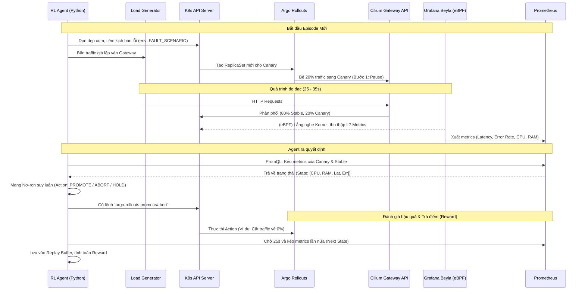

# K8s RL Canary Agent (eBPF & Gateway API)

Kho lưu trữ này chứa một môi trường Sandbox "Digital Twin" chuyên dụng, được thiết kế để huấn luyện một Tác tử Học tăng cường (Reinforcement Learning - PPO+LSTM) làm nhiệm vụ quản lý quá trình phát hành Canary trên Kubernetes.

Kiến trúc này tận dụng **Cilium (CNI)**, **Gateway API** để định tuyến luồng traffic L7, **Grafana Beyla (eBPF)** để thu thập metrics không cần cài sidecar (zero-instrumentation), và **Argo Rollouts** để quản lý vòng đời của bản Canary.

---

## 🏗 System Architecture (Kiến trúc hệ thống)

Hệ thống hoạt động dưới 2 chế độ riêng biệt: **Huấn luyện (External Controller)** và **Vận hành thực tế (Native GitOps Webhook)**. Dưới đây là sơ đồ luồng hoạt động cho **Chế độ Huấn luyện**, nơi một script Python đóng vai trò làm nhạc trưởng điều phối toàn bộ môi trường.



---

## 🚀 Hướng dẫn Triển khai (Step-by-Step)

Hãy làm theo các bước dưới đây để tái tạo lại chính xác kiến trúc on-premise này từ con số 0.

### 1. Chuẩn bị OS và Cài đặt K8s (Kubeadm) + Cilium CNI

Trước khi khởi tạo cụm, ta cần chuẩn bị OS (Ubuntu/Debian) bằng cách tắt Swap, nạp kernel modules và cài đặt `containerd`, `kubelet`, `kubeadm`, `kubectl`. Sau đó khởi tạo cụm K8s nhưng **bỏ qua** việc cài đặt Kube-proxy mặc định để dọn đường cho Cilium eBPF thay thế hoàn toàn.

```bash
# 1. Tắt Swap (Bắt buộc cho K8s)
sudo swapoff -a
sudo sed -i '/ swap / s/^\(.*\)$/#\1/g' /etc/fstab

# 2. Nạp module và cấu hình mạng (IPv4 forwarding)
cat <<EOF | sudo tee /etc/modules-load.d/k8s.conf
overlay
br_netfilter
EOF
sudo modprobe overlay && sudo modprobe br_netfilter
cat <<EOF | sudo tee /etc/sysctl.d/k8s.conf
net.bridge.bridge-nf-call-iptables  = 1
net.bridge.bridge-nf-call-ip6tables = 1
net.ipv4.ip_forward                 = 1
EOF
sudo sysctl --system

# 3. Cài đặt Containerd và Kubeadm, Kubelet, Kubectl
sudo apt-get update && sudo apt-get install -y apt-transport-https ca-certificates curl containerd
sudo mkdir -p /etc/apt/keyrings
curl -fsSL https://pkgs.k8s.io/core:/stable:/v1.29/deb/Release.key | sudo gpg --dearmor -o /etc/apt/keyrings/kubernetes-apt-keyring.gpg
echo 'deb [signed-by=/etc/apt/keyrings/kubernetes-apt-keyring.gpg] https://pkgs.k8s.io/core:/stable:/v1.29/deb/ /' | sudo tee /etc/apt/sources.list.d/kubernetes.list
sudo apt-get update && sudo apt-get install -y kubelet kubeadm kubectl
sudo apt-mark hold kubelet kubeadm kubectl

# 4. Khởi tạo K8s cluster KHÔNG có Kube-proxy mặc định
sudo kubeadm init --skip-phases=addon/kube-proxy

# 5. Cấu hình Kubeconfig cho user hiện tại
mkdir -p $HOME/.kube
sudo cp -i /etc/kubernetes/admin.conf $HOME/.kube/config
sudo chown $(id -u):$(id -g) $HOME/.kube/config

# 6. Cài đặt Cilium CLI
CILIUM_CLI_VERSION=$(curl -s https://raw.githubusercontent.com/cilium/cilium-cli/main/stable.txt)
CLI_ARCH=amd64
curl -L --fail --remote-name-all https://github.com/cilium/cilium-cli/releases/download/${CILIUM_CLI_VERSION}/cilium-linux-${CLI_ARCH}.tar.gz
sudo tar xzvfC cilium-linux-${CLI_ARCH}.tar.gz /usr/local/bin

# 7. Cài đặt Cilium qua Helm/CLI (Kích hoạt Gateway API)
cilium install \
  --set kubeProxyReplacement=true \
  --set gatewayAPI.enabled=true \
  --set hubble.enabled=true \
  --set hubble.metrics.enableOpenMetrics=true \
  --set hubble.metrics.enabled="{dns,drop,tcp,flow,port-distribution,icmp,httpV2:exemplars=true;labelsContext=source_ip\,source_namespace\,source_workload\,destination_ip\,destination_namespace\,destination_workload\,traffic_direction}"
```

### 2. Triển khai Monitoring (Prometheus) & Grafana Beyla (eBPF)

Thay vì phải tiêm các sidecar nặng nề (như Istio) vào từng Pod, chúng ta sử dụng **Grafana Beyla** để tự động đo đạc ứng dụng trực tiếp từ tầng Kernel thông qua công nghệ eBPF.

```bash
# 1. Cài đặt Kube-Prometheus-Stack (Grafana + Prometheus)
helm repo add prometheus-community https://prometheus-community.github.io/helm-charts
helm repo update
helm install monitoring prometheus-community/kube-prometheus-stack -n monitoring --create-namespace

# 2. Cài đặt Grafana Beyla (eBPF Auto-instrumentation)
helm repo add grafana https://grafana.github.io/helm-charts
helm repo update
helm install beyla grafana/beyla -n monitoring \
  --set global.prometheus.enabled=true \
  --set global.prometheus.serviceMonitor.enabled=true
```

*(Lưu ý: Các file cấu hình chi tiết cho Beyla ServiceMonitor và Prometheus scraping đã được lưu sẵn trong thư mục `gitops/` của dự án).*

### 3. Cài đặt Argo Rollouts & Gateway API Plugin

Argo Rollouts đóng vai trò quản lý vòng đời của các đợt phát hành Canary. Để nó có thể điều khiển được tính năng chia traffic của Cilium Gateway API, ta cần phải nạp thêm một Plugin chuyên dụng.

```bash
# 1. Cài đặt CRDs cho K8s Gateway API
kubectl get crd gateways.gateway.networking.k8s.io &> /dev/null || \
  { kubectl kustomize "github.com/kubernetes-sigs/gateway-api/config/crd/experimental?ref=v1.1.0" | kubectl apply -f -; }

# 2. Cài đặt Argo Rollouts
kubectl create namespace argo-rollouts
kubectl apply -n argo-rollouts -f https://github.com/argoproj/argo-rollouts/releases/latest/download/install.yaml

# 3. Patch Argo Rollouts để tải GatewayAPI Plugin
# (Dựa trên config map argo-rollouts-config)
cat <<EOF | kubectl apply -f -
apiVersion: v1
kind: ConfigMap
metadata:
  name: argo-rollouts-config
  namespace: argo-rollouts
data:
  rollout-controller-config: |
    trafficRoutingPlugins:
      argoproj-labs/gatewayAPI:
        command: /plugins/gatewayapi-plugin-linux-amd64
        args: ["-log-level", "debug"]
EOF
```

---

## 🧠 Tổng quan Pipeline Huấn luyện (Training)

Để bắt đầu chạy quá trình huấn luyện RL Agent trên cụm K8s thực tế:

1. **Chuẩn bị:** Đảm bảo Locust (công cụ giả lập tải) và các thư viện Python (Stable Baselines 3, K8s client) đã được cài đặt.
2. **Khởi chạy:**
   ```bash
   python training/online_training.py
   ```
3. **Cơ chế hoạt động:**
   - Script sẽ liên tục đưa môi trường về trạng thái Stable (100% traffic).
   - Tự động bơm ngẫu nhiên các kịch bản lỗi (`high_latency`, `high_error`, `combined`, `none`) thông qua việc thay đổi biến môi trường `FAULT_SCENARIO` trong Pod.
   - Agent cào metrics từ Prometheus (dữ liệu do Beyla eBPF cung cấp), tự động phân tích mã Hash độc nhất của từng ReplicaSet mới để **cô lập tuyệt đối** số liệu giữa các tập (episodes).
   - Dựa trên metrics thu được, Agent phán đoán tình hình, ban phát điểm thưởng (Reward) và xuất Action thao túng trực tiếp cụm K8s.
