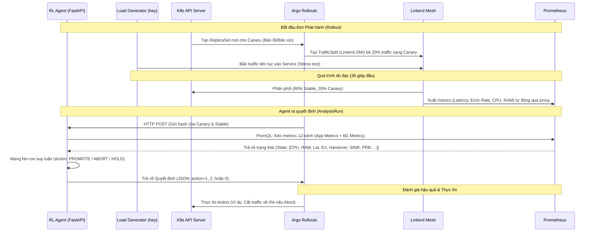

# K8s RL Canary Agent (Linkerd & SMI) - 6G Edition

Kho lưu trữ này chứa một môi trường Sandbox "Digital Twin" chuyên dụng, được thiết kế để huấn luyện và vận hành một Tác tử Học tăng cường (Reinforcement Learning - TransformerPPO) làm nhiệm vụ quản lý quá trình phát hành Canary trên Kubernetes một cách tự động và an toàn.

Đặc biệt, Agent trong phiên bản này đã được **nâng cấp để nhận diện và thích ứng với môi trường mạng 6G**. Agent có khả năng phân biệt giữa biến động metrics do lỗi ứng dụng (Application Faults) và biến động do sóng vô tuyến 6G (Network Noise như đứt sóng vệ tinh NTN, vật cản THz, xung đột radar ISAC).

---

## 🏗 System Architecture (Kiến trúc hệ thống)

Hệ thống hoạt động dưới 2 chế độ riêng biệt: **Huấn luyện (Offline Training Twin)** và **Vận hành thực tế (GitOps Webhook)**. Dưới đây là sơ đồ luồng hoạt động tổng quát:


```mermaid
sequenceDiagram
    participant Agent as RL Agent (FastAPI)
    participant Hey as Load Generator (hey)
    participant K8s as K8s API Server
    participant Argo as Argo Rollouts
    participant L5d as Linkerd Mesh
    participant Prom as Prometheus

    Note over Agent, Prom: Bắt đầu Đợt Phát hành (Rollout)
    K8s->>Argo: Tạo ReplicaSet mới cho Canary (Bản lỗi/Bản xịn)
    Argo->>L5d: Tạo TrafficSplit (Linkerd-SMI) bẻ 20% traffic sang Canary
    Hey->>L5d: Bắn traffic liên tục vào Service (Stress test)
    
    Note over Hey, Prom: Quá trình đo đạc (30 giây đầu)
    L5d->>K8s: Phân phối (80% Stable, 20% Canary)
    L5d->>Prom: Xuất metrics (Latency, Error Rate, CPU, RAM) tự động qua proxy
    
    Note over Agent, Prom: Agent ra quyết định (AnalysisRun)
    Argo->>Agent: HTTP POST (Gửi hash của Canary & Stable)
    Agent->>Prom: PromQL: Kéo metrics 12-kênh (App Metrics + 6G Metrics)
    Prom-->>Agent: Trả về trạng thái (State: [CPU, RAM, Lat, Err, Handover, SINR, PRB, ...])
    Agent->>Agent: Mạng Nơ-ron suy luận (Action: PROMOTE / ABORT / HOLD)
    Agent->>Argo: Trả về Quyết định (JSON: action=1, 2, hoặc 0)
    
    Note over Argo, Prom: Đánh giá hậu quả & Thực thi
    Argo->>K8s: Thực thi Action (Ví dụ: Cắt traffic về 0% nếu Abort)
```

---

## 🚀 Hướng dẫn Triển khai (Step-by-Step)

Hãy làm theo các bước dưới đây để tái tạo lại chính xác kiến trúc on-premise này từ con số 0.

### 1. Chuẩn bị OS và Cài đặt K8s (Kubeadm) + Cilium CNI

Trước khi khởi tạo cụm, ta cần chuẩn bị OS (Ubuntu/Debian/WSL) bằng cách tắt Swap, nạp kernel modules và cài đặt `containerd`, `kubelet`, `kubeadm`, `kubectl`. Khởi tạo cụm K8s nhưng **bỏ qua** cài đặt Kube-proxy mặc định để Cilium eBPF thay thế hoàn toàn.

### 1. Tắt Swap (Bắt buộc cho K8s)
```bash
sudo swapoff -a
sudo sed -i '/ swap / s/^\(.*\)$/#\1/g' /etc/fstab
```
### 2. Nạp module và cấu hình mạng (IPv4 forwarding)
```bash
cat <<EOF | sudo tee /etc/modules-load.d/k8s.conf
overlay
br_netfilter
EOF
sudo modprobe overlay && sudo modprobe br_netfilter
cat <<EOF | sudo tee /etc/sysctl.d/k8s.conf
net.bridge.bridge-nf-call-iptables  = 1
net.bridge.bridge-nf-call-ip6tables = 1
net.ipv4.ip_forward                 = 1
EOF
sudo sysctl --system
```
### 3. Cài đặt Containerd và Kubeadm, Kubelet, Kubectl
```bash
sudo apt-get update && sudo apt-get install -y apt-transport-https ca-certificates curl containerd
sudo mkdir -p /etc/apt/keyrings
curl -fsSL https://pkgs.k8s.io/core:/stable:/v1.31/deb/Release.key | sudo gpg --dearmor -o /etc/apt/keyrings/kubernetes-apt-keyring.gpg
echo 'deb [signed-by=/etc/apt/keyrings/kubernetes-apt-keyring.gpg] https://pkgs.k8s.io/core:/stable:/v1.31/deb/ /' | sudo tee /etc/apt/sources.list.d/kubernetes.list
sudo apt-get update && sudo apt-get install -y kubelet kubeadm kubectl
sudo apt-mark hold kubelet kubeadm kubectl
```

### 4. Khởi tạo K8s cluster KHÔNG có Kube-proxy mặc định
```bash
sudo kubeadm init --skip-phases=addon/kube-proxy
```
### 5. Cấu hình Kubeconfig
```bash
mkdir -p $HOME/.kube
sudo cp -i /etc/kubernetes/admin.conf $HOME/.kube/config
sudo chown $(id -u):$(id -g) $HOME/.kube/config
```
### 6. Cài đặt Cilium CLI và Cilium CNI
```bash
# Cài đặt Cilium CLI
CILIUM_CLI_VERSION=$(curl -s https://raw.githubusercontent.com/cilium/cilium-cli/main/stable.txt)
CLI_ARCH=amd64
if [ "$(uname -m)" = "aarch64" ]; then CLI_ARCH=arm64; fi
curl -L --fail --remote-name-all https://github.com/cilium/cilium-cli/releases/download/${CILIUM_CLI_VERSION}/cilium-linux-${CLI_ARCH}.tar.gz{,.sha256sum}
sha256sum --check cilium-linux-${CLI_ARCH}.tar.gz.sha256sum
sudo tar xzvfC cilium-linux-${CLI_ARCH}.tar.gz /usr/local/bin
rm cilium-linux-${CLI_ARCH}.tar.gz{,.sha256sum}

# Cài đặt Cilium (CNI)
cilium install \
  --set kubeProxyReplacement=true \
  --set hubble.enabled=true \
  --set hubble.metrics.enableOpenMetrics=true \
  --set hubble.metrics.enabled="{dns,drop,tcp,flow,port-distribution,icmp,httpV2:exemplars=true;labelsContext=source_ip\,source_namespace\,source_workload\,destination_ip\,destination_namespace\,destination_workload\,traffic_direction}"
```
### 7. Cài đặt Linkerd CLI, Control Plane & Viz
```bash
curl --proto '=https' --tlsv1.2 -sSfL https://run.linkerd.io/install | sh
export PATH=$PATH:$HOME/.linkerd2/bin
linkerd install --crds | kubectl apply -f -
linkerd install | kubectl apply -f -
linkerd check

# Cài đặt Linkerd-Viz
linkerd viz install | kubectl apply -f -
linkerd viz check
```

### 8. Cài đặt ArgoCD (GitOps Controller) & Argo Rollouts
```bash
# Cài đặt ArgoCD
kubectl create namespace argocd
kubectl apply -n argocd -f https://raw.githubusercontent.com/argoproj/argo-cd/stable/manifests/install.yaml

# Cài đặt Argo Rollouts
kubectl create namespace argo-rollouts
kubectl apply -n argo-rollouts -f https://github.com/argoproj/argo-rollouts/releases/latest/download/install.yaml

# Cài đặt kubectl plugin cho Argo Rollouts
curl -LO https://github.com/argoproj/argo-rollouts/releases/latest/download/kubectl-argo-rollouts-linux-amd64
chmod +x ./kubectl-argo-rollouts-linux-amd64
sudo mv ./kubectl-argo-rollouts-linux-amd64 /usr/local/bin/kubectl-argo-rollouts
```
### 9. Triển khai tự động toàn bộ hệ thống (One-click GitOps)
```bash
# Cài đặt theo thứ tự: Monitoring -> Base (CRDs) -> Linkerd SMI -> Microservices
kubectl apply -f root-app.yaml
```
---

## 🌩️ GitOps & Chaos Testing (Thử nghiệm với RL Agent)

Hệ thống cho phép bạn "bơm lỗi" trực tiếp vào Microservices để xem AI Agent (RL Model TransformerPPO) phản ứng như thế nào (Promotion hay Abort) thông qua các biến môi trường cấu hình tại [service-b-configmap.yaml](gitops/releases/service-b-configmap.yaml) được tự động mount đè lên source code Python bằng tính năng `extraVolumes`.

### Các biến Chaos hỗ trợ:
- `CHAOS_ERROR_RATE`: Mô phỏng tỷ lệ lỗi (Ví dụ: `0.1` = 10% HTTP 503).
- `CHAOS_DELAY_MS`: Mô phỏng High Latency (Trễ vài nghìn ms).
- `CHAOS_CPU_BURN_ITERS`: Mô phỏng High CPU.
- `CHAOS_MEM_ALLOC_MB`: Mô phỏng ngốn RAM gây OOM.

### Cách tự Trigger kịch bản lỗi (Manual Patching)
Thay vì sửa code trên Git (bẩn source code), bạn hãy Patch tạm thời lên Cụm K8s. RL Agent sẽ tự phân tích và đưa ra quyết định.

**Kịch bản 1: Test Lỗi (Error Rate - 100%)**
```bash
wsl -d k3s kubectl patch rollout service-b -n twin --type=json -p='[
  {"op": "replace", "path": "/spec/template/spec/containers/0/env/2/name", "value": "CHAOS_ERROR_RATE"}, 
  {"op": "replace", "path": "/spec/template/spec/containers/0/env/2/value", "value": "1.0"}
]'
```

**Kịch bản 2: Test Độ Trễ (High Latency - 2000ms)**
```bash
wsl -d k3s kubectl patch rollout service-b -n twin --type=json -p='[
  {"op": "replace", "path": "/spec/template/spec/containers/0/env/2/name", "value": "CHAOS_DELAY_MS"}, 
  {"op": "replace", "path": "/spec/template/spec/containers/0/env/2/value", "value": "2000"}
]'
```

**Cách giám sát Agent:**
Theo dõi `AnalysisRun` sinh ra:
```bash
wsl -d k3s kubectl get analysisrun -n twin -w
```
Khi Agent nhận thấy sự bất thường thông qua metrics từ Prometheus, nó sẽ trả về kết quả `Failed` (Abort) với JSON `{"action": 2, "decision": "Rollback"}` để cắt bỏ 20% traffic độc hại.

### Phục hồi nguyên trạng (Reset)
Bật **ArgoCD UI** -> Nhấn **SYNC** ứng dụng `service-b-twin`. Mọi trạng thái Patch thủ công sẽ bị xoá sổ, ứng dụng được phục hồi về bản khoẻ mạnh.

---

## 🧠 Tổng quan Pipeline Huấn luyện (Offline Training)

Để huấn luyện (Train) lại RL Agent cho môi trường 6G, dự án cung cấp một Simulator mạnh mẽ (Digital Twin) với 12 kênh (channels) thông số. Môi trường này mô phỏng các kịch bản lỗi hệ thống (Crash, Leak) hòa trộn cùng các kịch bản nhiễu sóng vật lý 6G (Handover Storm, NTN Gap, THz Blockage, ISAC Contention). 

Để bắt đầu quy trình huấn luyện TransformerPPO (150,000 steps), hãy chạy lệnh:
```bash
python training/offline_training.py
```

- Mã nguồn mô phỏng nằm tại `core/env.py`.
- Model sẽ tự đánh giá (validate) vào cuối phiên huấn luyện và tự động xuất sơ đồ hội tụ vào thư mục `logs/transformer_offline`. 
- **Theo dõi biểu đồ Tensorboard thời gian thực:**
  ```bash
  tensorboard --logdir logs/transformer_offline
  ```

---

## 📚 Cấu trúc Tài liệu Chi tiết
Dự án được module hóa, và để đi sâu vào chi tiết của từng thành phần, mời bạn tham khảo các tài liệu nội bộ sau:
- [GitOps Base (CRD & Agent Integration)](gitops/base/README.md): Cách tích hợp Tác tử học tăng cường dưới dạng CRD và Controller vào K8s.
- [GitOps Bootstrap (Environments)](gitops/charts/bootstrap/README.md): Định nghĩa kiến trúc môi trường `twin` và `prod`.
- [GitOps Universal Canary (Rollout Flow)](gitops/charts/universal-canary/README.md): Giải phẫu chi tiết luồng Canary, sự tương tác giữa Argo, Analysis và Agent.
- [GitOps Releases (Chaos Testing)](gitops/releases/README.md): Cách tiêm lỗi (Chaos Engineering) thông qua cấu hình môi trường.
- [Load Generator (Traffic Gen)](loadgenerator/README.md): Cấu trúc kiến trúc thành phần sinh tải ảo.
- [Sample Microservice (Target Apps)](services/src/README.md): Kiến trúc ứng dụng mục tiêu được tiêm lỗi bằng FastAPI & gRPC.
- [RL Agent Services (AI & UI)](services/agent/README.md): Kiến trúc của mô hình TransformerPPO và Dashboard theo dõi trực tiếp.

## Nếu dùng private cloud (Openstack)
ArgoCD:
```Powershell
  ssh -L 30443:localhost:30443 thentt@192.168.120.206 -i "C:\Users\ASUS\.ssh\id_rsa"
```
Prometheus:
```Powershell
  ssh -L 9090:localhost:30090 thentt@192.168.120.206 -i "C:\Users\ASUS\.ssh\id_rsa"
```
kubectl client:
```Powershell
  ssh -L 6443:10.0.0.203:6443 thentt@192.168.120.206 -i "C:\Users\ASUS\.ssh\id_rsa"
```

## Sơ đồ

```mermaid
%%{init: {
  "theme": "base",
  "themeVariables": {
    "primaryColor": "#ffffff",
    "primaryTextColor": "#222222",
    "primaryBorderColor": "#888888",
    "lineColor": "#999999",
    "secondaryColor": "#f5f7fa",
    "tertiaryColor": "#ffffff",
    "fontSize": "14px",
    "fontFamily": "Segoe UI, Helvetica, Arial, sans-serif"
  },
  "flowchart": {
    "nodeSpacing": 25,
    "rankSpacing": 35,
    "curve": "basis",
    "htmlLabels": true,
    "useMaxWidth": true
  }
}}%%
flowchart LR
    %% Định nghĩa giao diện các khối
    classDef dashbox fill:#ffffff,stroke:#999,stroke-width:1.5px,stroke-dasharray: 4 4;
    classDef solidbox fill:#fbfbfc,stroke:#aaa,stroke-width:1px;
    classDef feedbacknode fill:#f0f0f0,stroke:#bbb,stroke-width:0.5px,font-size:10px,color:#777;
    %% ================= KHỐI 1: CI/CD (BÊN TRÁI) =================
    subgraph CI_CD ["Khu vực CI/CD & Phát triển"]
        direction BT
        Dev["Dev Team"] --> VCS["Version Control System"]
        VCS --> CI["CI Build"]
        CI -- "Artifacts" --> Registry["Container Registry"]
        
        DevOps["DevOps Team"] --> Manifests["Deployment Manifests"]
    end
    %% ================= KHỐI 2: CD SPACE (Ở GIỮA) =================
    subgraph CD_Space ["Continuous Delivery Space (Hạ tầng Edge 6G)"]
        direction TB
        Orchestrator["Container Orchestrator(s)<br/>(Edge K8s / ArgoCD)"]
        Controller["Service Controller<br/>(Argo Rollouts)"]
        AI["AI/RL Engine<br/>(Transformer + PPO)"]
        
        subgraph App_Space ["Microservices Application"]
            direction TB
            MS1["Microservice #1"]
            MS2["Microservice #2"]
            
            subgraph Target ["Dịch vụ Canary"]
                Stable["Microservice #3 (Stable)"]
                Canary["Microservice #3 (Canary)"]
            end
            
            MS4["Microservice #4 ... #n"]
            Frontend["Frontend Microservice<br/>(Edge Gateway)"]
            
            MS2 --> Target
            Frontend --> MS1
            Frontend --> MS2
            Frontend --> Target
            Frontend --> MS4
        end
        
        Orchestrator --> Frontend
        Orchestrator <--> Controller
        Controller --> Target
        
        AI -- "Traffic Routing Signals" --> Controller
        Orchestrator --> AI
        MonitorNode(("Monitoring Data")):::feedbacknode
        MS1 -.-> MonitorNode
        MS2 -.-> MonitorNode
        Target -.-> MonitorNode
        MS4 -.-> MonitorNode
        MonitorNode -- "CPU, RAM,<br/>Sub-ms Latency" --> AI
    end
    %% ================= KHỐI 3: NGƯỜI DÙNG (BÊN PHẢI) =================
    subgraph Users ["Khu vực Người dùng"]
        direction TB
        U1["User #1<br/>(E-sports/URLLC)"]
        U2["User #2"]
        Un["User #n"]
    end
    %% ================= KHỐI NS-3 =================
    NS3["ns-3 Simulator<br/>(Dữ liệu giả lập mạng 6G)"]
    %% ================= CÁC ĐƯỜNG LIÊN KẾT =================
    %% CI/CD đổ vào Orchestrator
    Registry --> Orchestrator
    Manifests --> Orchestrator
    
    %% Đường Feedback Loop: dùng node ẩn đại diện thay vì nối thẳng vào subgraph App_Space
    %% (nối thẳng vào subgraph là nguyên nhân gây lỗi "Not possible to find intersection")
    FeedbackNode(("Feedback Signals")):::feedbacknode
    App_Space --> FeedbackNode
    FeedbackNode --> DevOps
    FeedbackNode --> Dev
    
    %% Users truy cập vào Frontend (dùng mũi tên ngược để ép Users nằm bên phải)
    Frontend <== "Request" === U1
    Frontend <== "Request" === U2
    Frontend <== "Request" === Un
    
    %% ns-3 cung cấp dữ liệu cho AI
    NS3 -.-> |"Offline Training Traces"| AI
    %% ================= GÁN STYLE =================
    class CD_Space,App_Space,Target dashbox;
    class CI_CD,Users solidbox;
```