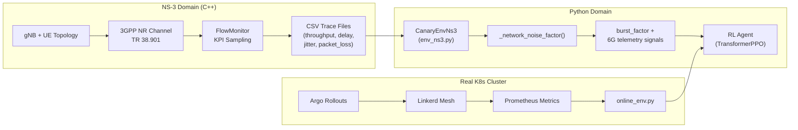

# Phân tích NS-3, Metrics 6G và Baseline Học thuật

## Phần 1: Cách hoạt động của NS-3

### 1.1 Kiến trúc tổng quát NS-3

NS-3 (Network Simulator 3) là một bộ mô phỏng mạng sự kiện rời rạc (Discrete-Event Simulator — DES) viết bằng C++, được dùng phổ biến nhất trong nghiên cứu học thuật về mạng viễn thông.

```mermaid
graph TD
    subgraph "NS-3 Engine"
        A["Scheduler<br/>(Event Queue)"] --> B["Simulator::Run()"]
        B --> C["Process Event at time T"]
        C --> D["Event triggers callbacks"]
        D --> E["Callbacks schedule new events"]
        E --> A
    end

    subgraph "NS-3 Module Stack"
        F["Application Layer<br/>(UdpClient, PacketSink)"]
        G["Transport Layer<br/>(UDP/TCP Socket)"]
        H["Network Layer<br/>(IPv4, Routing)"]
        I["Link Layer<br/>(NR MAC, RLC, PDCP)"]
        J["PHY Layer<br/>(NR PHY, Channel Model)"]
        K["Channel Model<br/>(3GPP TR 38.901)"]
    end

    F --> G --> H --> I --> J --> K
```



**Nguyên lý hoạt động cốt lõi:**

1. **Event-Driven**: NS-3 không chạy theo clock đều đặn. Nó duy trì một hàng đợi sự kiện (priority queue) sắp xếp theo thời gian. Mỗi khi xử lý xong 1 sự kiện, nó nhảy đến sự kiện tiếp theo — có thể cách 1ns hoặc 1s.

2. **Node-based topology**: Mọi thực thể mạng (gNB, UE, router, server) đều là `Node`. Mỗi Node được gắn:
   - `NetDevice` (card mạng — ví dụ `NrUeNetDevice`)
   - `MobilityModel` (vị trí/chuyển động)
   - `Application` (sinh/nhận traffic)
   - `Protocol Stack` (IP, TCP/UDP)

3. **Helper Pattern**: NS-3 dùng pattern Helper để đơn giản hóa việc cấu hình. Ví dụ `NrHelper` lo toàn bộ việc tạo gNB PHY, MAC, RLC, PDCP, EPC core...

### 1.2 Cách mô phỏng kịch bản Kubernetes/Microservices trong NS-3

> [!IMPORTANT]
> NS-3 **không** mô phỏng trực tiếp Kubernetes hay containers. NS-3 mô phỏng **tầng mạng vật lý và truyền tải** — tức là phần hạ tầng RAN (Radio Access Network) và transport mà traffic của Kubernetes phải đi qua.

Trong dự án của bạn, cách tiếp cận **hybrid** rất hợp lý:



**Luồng hoạt động cụ thể trong project của bạn:**

1. **NS-3 scenarios** ([cttc-nr-scenario-*.cc](file:///c:/Users/ASUS/Desktop/rl/ns-3_scenarios)) tạo topology NR (gNB + UE), chạy traffic UDP, thu KPI qua `FlowMonitor` → xuất CSV.

2. **Python env** ([env_ns3.py](file:///c:/Users/ASUS/Desktop/rl/core/env_ns3.py)) đọc CSV traces, biến throughput/delay/jitter/lost_packets thành `burst_factor` (nhân vào latency) và `network_raw` (telemetry 6G).

3. **RL Agent** nhận observation 12-kênh, học phân biệt: "latency tăng do mạng hay do app?"

### 1.3 Cách NS-3 mô phỏng kịch bản cụ thể trong project

| Scenario | File NS-3 | Cơ chế mô phỏng |
|---|---|---|
| **Stable** | [cttc-nr-scenario-stable.cc](file:///c:/Users/ASUS/Desktop/rl/ns-3_scenarios/cttc-nr-scenario-stable.cc) | 1 gNB, 2 UE, dual-band 28 GHz, GridScenario, FlowMonitor sampling mỗi 0.1s |
| **HandoverStorm** | [cttc-nr-scenario-handover-storm.cc](file:///c:/Users/ASUS/Desktop/rl/ns-3_scenarios/cttc-nr-scenario-handover-storm.cc) | 3 gNB, scheduled HandoverRequest + UE teleport → tạo handover liên tục |
| **NTN Gap** | [cttc-nr-scenario-ntn-gap.cc](file:///c:/Users/ASUS/Desktop/rl/ns-3_scenarios/cttc-nr-scenario-ntn-gap.cc) | LEO satellite (LeoOrbitNodeHelper), GeocentricMobility, NTN channel model |
| **THz Blockage** | [cttc-nr-scenario-thz-blockage.cc](file:///c:/Users/ASUS/Desktop/rl/ns-3_scenarios/cttc-nr-scenario-thz-blockage.cc) | Periodic TxPower drop (-100 dBm) theo pattern step%7<2 |
| **ISAC Contention** | [cttc-nr-scenario-isac-contention.cc](file:///c:/Users/ASUS/Desktop/rl/ns-3_scenarios/cttc-nr-scenario-isac-contention.cc) | UE thứ 3 phát traffic nhiễu với packet interval dao động sin: `0.3 + 0.3*sin(t*0.5)²` |

---

## Phần 2: Đánh giá Metrics và Kịch bản Hiện tại

### 2.1 Các Metrics đang lấy (feature_pipeline.py)

Hiện tại [feature_pipeline.py](file:///c:/Users/ASUS/Desktop/rl/core/feature_pipeline.py) lấy **17 raw metrics**, normalize thành **15 state features** (12 được dùng làm observation):

#### ✅ Điểm tốt

| Metric | Đánh giá |
|---|---|
| `weight_pct` | ✅ Tốt — cần thiết cho canary rollout context |
| `e_canary/e_stable` → `e_ratio_n`, `e_gap_n` | ✅ Tốt — core signal cho app fault detection |
| `l_canary/l_stable` → `l_ratio_n`, `l_gap_n` | ✅ Tốt — core signal, và đã fix bug asymmetric noise |
| `cpu_canary/cpu_stable` → `cpu_n` | ✅ Tốt — resource utilization |
| `mem_canary/mem_stable` → `mem_n` | ✅ Tốt — memory leak detection |
| `rps` → `rps_n` | ✅ Tốt — traffic load context |
| `handover_count` → `handover_n` | ✅ Tốt — mobility event indicator |
| `sinr_db` → `sinr_n` | ⚠️ **Cần cải thiện** — xem phân tích bên dưới |
| `prb_util` → `prb_n` | ⚠️ **Cần cải thiện** |
| `harq_nack` → `harq_n` | ⚠️ **Cần cải thiện** |
| `ntn_gap` → `ntn_gap_n` | ⚠️ **Cần cải thiện** — binary quá thô |
| `isac_contention` → `isac_n` | ⚠️ **Cần cải thiện** |
| `time_since_deploy` → `deploy_age_n` | ✅ Tốt — temporal context |

#### ⚠️ Các vấn đề cần cải thiện

**1. SINR normalization sai dải giá trị:**
```python
# Hiện tại (line 86):
"sinr_n": _clip((raw.get("sinr_db", -85.0) + 130.0) / 60.0, 0.0, 1.0)
```
- Dải map: `-130 dB` → 0.0, `-70 dB` → 1.0
- **Vấn đề**: Theo 3GPP và ns-3 5G-LENA, SINR trong NR thường nằm trong khoảng **-10 dB đến +30 dB** (terrestrial), và **-5 dB đến +20 dB** (NTN). Giá trị `-85 dB` hay `-120 dB` cho SINR là **không thực tế** — đây là giá trị RSRP (Reference Signal Received Power), không phải SINR.
- **Fix**: Nên dùng dải `-10 dB → +30 dB` cho SINR, hoặc tách riêng RSRP và SINR.

**2. HARQ NACK rate thiếu baseline chuẩn:**
```python
# Hiện tại (line 88):
"harq_n": _clip(raw.get("harq_nack", 0.0) / 0.3, 0.0, 1.0)
```
- HARQ NACK rate chuẩn theo 3GPP: BLER (Block Error Rate) target là **10%** cho eMBB (đầu tiên), tức HARQ NACK ≈ 0.1. Sau retransmission, BLER phải xuống **< 10⁻⁵** (URLLC).
- **Vấn đề**: Max 0.3 (30%) cho normalization là hợp lý cho fault scenario, nhưng giá trị baseline 0.02 (2%) hơi thấp — nên là 0.05-0.10 cho eMBB traffic.

**3. NTN Gap là binary (0/1) — thiếu granularity:**
- Thực tế NTN gap có thể biểu thị bằng **propagation delay** (20-40ms cho LEO), **elevation angle** (ảnh hưởng path loss), hoặc **gap duration**.
- Binary flag không cho agent đủ thông tin để ước lượng mức độ ảnh hưởng.

**4. PRB Utilization hardcoded:**
- `prb_util` = 0.4 (mặc định) hoặc 0.6 (HandoverStorm) — không được derive từ ns-3 traces.
- Nên extract từ scheduler traces trong ns-3 hoặc tính từ throughput/bandwidth ratio.

**5. Thiếu một số metrics quan trọng theo baseline học thuật** (xem Phần 3).

### 2.2 Đánh giá Kịch bản Mô phỏng

#### ✅ Điểm tốt
- 5 kịch bản đa dạng phủ các failure mode chính của 6G
- Tách biệt App Scenario và Network Scenario (5×5 = 25 combinations)
- Burst factor applied đối xứng (symmetrically) lên cả canary và stable — thiết kế rất quan trọng và đúng đắn

#### ⚠️ Vấn đề kịch bản

**1. Trace data quá ít (5-31 rows mỗi file):**

| Trace | Rows | Thời gian mô phỏng |
|---|---|---|
| Stable | 11 | 0.5s → 0.9s (5 samples) |
| HandoverStorm | 31 | 0.5s → 0.9s (5 timestamps × 6 flows) |
| NTN Gap | 11 | 0.5s → 0.9s |
| THz Blockage | 11 | 0.5s → 0.9s |
| ISAC Contention | 11 | 0.5s → 0.9s |

- **Vấn đề nghiêm trọng**: Chỉ có **0.5 giây** dữ liệu mô phỏng. RL agent cần ≥50 steps/episode × 30 episodes = 1500 data points, nhưng trace chỉ có 5-6 unique samples → lặp vòng (modulo wrapping). Điều này khiến agent **overfitting vào vài giá trị** thay vì học pattern thật.
- **Fix**: Chạy ns-3 simulation lâu hơn (≥30 giây, tốt nhất 60-120s) với sampling interval 0.1-1.0s.

**2. THz Blockage trace có 4 rows toàn zero:**
```
0.5,1,0,0,0,0
0.5,2,0,0,0,0
0.6,1,0,0,0,0
0.6,2,0,0,0,0
```
- Throughput = 0, delay = 0 → nghĩa là **hoàn toàn mất kết nối** chứ không phải degradation. Trong thực tế THz blockage gây suy giảm SINR mạnh nhưng ít khi throughput = 0 hoàn toàn (có thể fallback sang sub-6 GHz).

**3. `env_ns3.py` reverse-engineer 6G telemetry bằng heuristic thay vì extract trực tiếp từ ns-3:**

```python
# Line 75-103 của env_ns3.py — "Reverse engineer 6G telemetry from traces"
network_raw = {
    "handover_count": 0,
    "sinr_db": -85.0 + np.random.normal(0, 1.0),  # ← Hardcoded + random!
    "prb_util": 0.4,                                # ← Hardcoded!
    ...
}
```

- NS-3 hoàn toàn có khả năng xuất **trực tiếp** SINR, RSRP, PRB utilization, HARQ stats — nhưng hiện tại các scenario `.cc` chỉ thu `FlowMonitor` metrics (throughput, delay, jitter, lost_packets).
- Telemetry 6G đang là **số giả (fabricated)** chứ không phải từ simulation.

---

## Phần 3: Gợi ý Baseline Học thuật và Cải tiến

### 3.1 Baseline Standards (Tiêu chuẩn tham chiếu)

Để giải pháp được công nhận trong giới học thuật, bạn cần căn cứ vào các tiêu chuẩn sau:

| Tiêu chuẩn | Nội dung liên quan | Cách áp dụng |
|---|---|---|
| **3GPP TS 28.552/28.554** | Định nghĩa chính thức các PM (Performance Measurement) cho NR: DL/UL throughput, latency, HARQ retransmission, handover success rate, PRB utilization | Dùng làm danh sách metrics chuẩn |
| **3GPP TR 38.901 v17+** | Channel model 0.5-100 GHz, path loss, fading | Xác nhận ns-3 channel model đúng chuẩn |
| **ITU-R IMT-2030** | 6G KPI targets: 50-200 Gbps peak, 0.1-1ms latency, reliability 1−10⁻⁷ | Dùng làm performance envelope |
| **3GPP TS 38.331** | RRC: A3 event, handover trigger conditions, TTT | Chuẩn hóa handover behavior |
| **ETSI GS NFV-IFA 027** | Performance measurement cho VNF/CNF trong MANO | Metrics cho microservices layer |
| **SNS JU White Papers** | "6G KPIs — Definitions and Target Values" | Chuẩn hóa KPI definitions |

### 3.2 Nghiên cứu liên quan (Related Work) cần tham khảo

#### A. NS-3 NR Simulation Baseline
1. **Koutlia et al. — "Calibration of the 5G-LENA System Level Simulator in 3GPP Reference Scenarios"**
   - Paper gốc từ CTTC (cùng nhóm với module 5G-LENA bạn đang dùng)
   - Cung cấp baseline SINR, throughput, latency cho các scenario chuẩn (UMa, UMi, Indoor)
   - **Dùng để**: Validate rằng SINR/throughput từ ns-3 scenarios của bạn nằm trong dải hợp lệ

2. **Patriciello et al. — "An E2E Simulator for 5G NR Networks" (Elsevier Simulation Modelling Practice and Theory, 2019)**
   - Mô tả kiến trúc end-to-end của 5G-LENA
   - **Dùng để**: Cite khi giải thích tại sao chọn ns-3 NR module

3. **Lagen et al. — "New Radio Physical Layer Abstraction for System-Level Simulations of 5G Networks"**
   - Giải thích HARQ, BLER, MCS adaptation trong ns-3
   - **Dùng để**: Justify giá trị HARQ NACK baseline

#### B. NTN (Non-Terrestrial Network) Simulation
4. **Leyva-Mayorga et al. — "ns3-ntn-toolkit: A Comprehensive Toolkit for Simulating Non-Terrestrial Networks in ns-3"**
   - Toolkit chính thức cho NTN trong ns-3 (compatible with ns-3.43)
   - **Dùng để**: Upgrade scenario NTN với LEO orbit model chuẩn, propagation delay model, conditional handover

5. **3GPP TR 38.811 — "Study on NR to support NTN"**
   - Kịch bản NTN chính thức: LEO (600-1200 km), MEO, GEO
   - Propagation delay: 3.4-7.2 ms (LEO), 120-140 ms (GEO)
   - **Dùng để**: Justify NTN gap duration và delay values

#### C. THz Communication & Blockage
6. **Petrov et al. — "IEEE 802.15.3d: First Standardization Efforts for Sub-Terahertz Band Communications toward 6G"**
   - Path loss model cho THz (>100 GHz)
   - Blockage probability models
   - **Dùng để**: Justify THz blockage pattern và severity

7. **Polese et al. — "End-to-End Simulation of 5G mmWave Networks" (IEEE Comms Surveys & Tutorials, 2020)**
   - Blockage model dựa trên human body, vehicle, building
   - **Dùng để**: Realistic blockage patterns thay vì periodic TxPower drop

#### D. ISAC (Integrated Sensing and Communication)
8. **Liu et al. — "Integrated Sensing and Communication: Toward Dual-Functional Wireless Networks for 6G and Beyond" (IEEE JSAC, 2022)**
   - Định nghĩa ISAC contention: sensing duty cycle vs communication throughput tradeoff
   - **Dùng để**: Formalize ISAC contention metric

9. **3GPP TR 22.837 — "Study on Integrated Sensing and Communication"**
   - Use cases, KPIs cho ISAC
   - **Dùng để**: Baseline official cho ISAC metrics

#### E. RL for Network Fault Detection
10. **"Efficient Microservice Deployment in Kubernetes Multi-Clusters through Reinforcement Learning" (NOMS 2024)**
    - RL cho service placement trong K8s multi-cluster
    - **Dùng để**: Related work cho RL + K8s

11. **"AI, ML, and LLM Integration in 5G/6G Networks: A Comprehensive Survey" (IEEE Access, 2025)**
    - Survey tổng hợp AI/ML trong 5G/6G
    - **Dùng để**: Position paper trong landscape

### 3.3 Đề xuất Metrics cần thêm/sửa (Recommended Baseline Metrics)

Dựa trên 3GPP TS 28.552 và các paper trên, đây là bộ metrics chuẩn mà tôi đề xuất:

#### Metrics Hạ tầng 6G (cần extract trực tiếp từ NS-3)

| # | Metric | Nguồn NS-3 | Normalization đề xuất | Baseline chuẩn |
|---|---|---|---|---|
| 1 | **SINR (dB)** | `NrUePhy::ReportCurrentCellRsrpSinr` trace | `(sinr + 10) / 40` → [0,1] cho dải [-10, +30] dB | 3GPP: Good ≥ 15 dB, Fair 5-15 dB, Poor < 5 dB |
| 2 | **RSRP (dBm)** | `NrUePhy::ReportCurrentCellRsrpSinr` trace | `(rsrp + 140) / 80` → [0,1] cho dải [-140, -60] dBm | **THIẾU** — nên thêm, quan trọng cho handover trigger |
| 3 | **Handover Count** | Handover trace source (`HandoverStart`) | `count / 10` clip [0,1] | A3 event: neighbor RSRP > serving + offset + hysteresis |
| 4 | **Handover Failure Rate** | Track failed vs attempted handovers | Trực tiếp [0,1] | **THIẾU** — nên thêm, quan trọng hơn raw count |
| 5 | **PRB Utilization** | Scheduler DL/UL allocation / total PRBs | Trực tiếp [0,1] | 3GPP TS 28.552: PRB Usage Rate |
| 6 | **HARQ NACK Rate (BLER)** | PHY HARQ feedback trace | `bler / 0.3` clip [0,1] | 3GPP: BLER target 10% (1st tx), < 10⁻⁵ after retx |
| 7 | **RLC Retx Rate** | `NrRlcUm/Am` retransmission trace | `retx_rate / 0.2` clip [0,1] | **THIẾU** — nên thêm, bổ sung cho HARQ |
| 8 | **NTN Propagation Delay (ms)** | Tính từ satellite altitude + elevation angle | `delay / 50.0` clip [0,1] (LEO max ~40ms) | 3GPP TR 38.811: 3.4-7.2ms (LEO 600km) |
| 9 | **NTN Link Availability** | Binary: satellite visible or not | Trực tiếp [0,1] | Thay thế `ntn_gap` binary hiện tại |
| 10 | **ISAC Duty Cycle** | Custom: sensing time / total time | Trực tiếp [0,1] | 3GPP TR 22.837: sensing duty cycle |
| 11 | **Packet Loss Rate** | FlowMonitor `lostPackets / (rxPackets + lostPackets)` | Trực tiếp [0,1] | **THIẾU** — đã có trong trace nhưng chưa dùng! |
| 12 | **Jitter (ms)** | FlowMonitor `jitterSum` | `jitter / 10.0` clip [0,1] | **THIẾU** — đã có trong trace nhưng chưa dùng! |

> [!WARNING]
> **Quan trọng nhất**: SINR, RSRP, PRB Utilization, HARQ NACK hiện tại **không được extract từ NS-3 simulation** mà đang được **fabricate bằng random values** trong `env_ns3.py`. Đây là điểm yếu lớn nhất nếu muốn publish — reviewer sẽ hỏi ngay "giá trị SINR từ đâu ra?"

### 3.4 Đề xuất Cải tiến Kịch bản Mô phỏng NS-3

#### A. Thay đổi chung cho tất cả scenarios
1. **Tăng thời gian mô phỏng**: Từ 1s → **30-120s** để có đủ data points
2. **Thêm PHY-layer trace sources**: Extract SINR, RSRP, CQI, HARQ NACK trực tiếp từ ns-3 bằng:
   ```cpp
   Config::ConnectWithoutContext(
       "/NodeList/*/DeviceList/*/ComponentCarrierMapUe/*/NrUePhy/ReportCurrentCellRsrpSinr",
       MakeCallback(&RsrpSinrCallback));
   ```
3. **Thêm MAC-layer traces**: PRB utilization từ scheduler
4. **Output enriched CSV**: Thêm cột sinr_db, rsrp_dbm, prb_util, harq_nack_rate, packet_loss_rate

#### B. Cải tiến từng scenario

**Scenario 1 — HandoverStorm:**
- Dùng `NrA3RsrpHandoverAlgorithm` thay vì manual `HandoverRequest` + teleport
- Cấu hình TTT (Time-to-Trigger) thấp (64-128ms) và A3 offset nhỏ (1-2 dB) để trigger nhiều handover tự nhiên
- Cho UE di chuyển (RandomWalk hoặc ConstantVelocity) thay vì teleport

**Scenario 2 — NTN Gap:**
- Sử dụng `ns3-ntn-toolkit` với SGP4 orbit propagator
- Mô phỏng satellite pass: gap tự nhiên khi satellite ra khỏi coverage (elevation < 10°)
- Thêm propagation delay varying theo elevation angle

**Scenario 3 — THz Blockage:**
- Thay TxPower drop thô (`-100 dBm`) bằng **3GPP blockage model** (TR 38.901 Sec 7.6.4):
  - Human body blockage: additional loss 15-40 dB
  - Self-blocking: azimuth-dependent
- Hoặc dùng `ThreeGppNTNPropagationLossModel` với dynamic NLOS/LOS switching

**Scenario 4 — ISAC Contention:**
- Scenario hiện tại chỉ dùng thêm 1 interference UE → chưa thật sự là ISAC
- Nên mô phỏng: **time-division** giữa sensing và communication (phân chia slot)
- Hoặc tối thiểu: document rõ rằng interference traffic đại diện cho sensing beams

### 3.5 Tóm tắt Mức độ Ưu tiên

| Ưu tiên | Hạng mục | Lý do |
|---|---|---|
| 🔴 **Cao nhất** | Extract SINR, RSRP, HARQ trực tiếp từ NS-3 thay vì fabricate | Reviewer sẽ reject nếu metrics là số giả |
| 🔴 **Cao nhất** | Tăng thời gian simulation (≥30s) | 5 data points/trace không đủ tính thống kê |
| 🟡 **Cao** | Fix SINR normalization range | -85 dB không phải SINR, phải là [-10, +30] dB |
| 🟡 **Cao** | Thêm RSRP, Packet Loss Rate, Jitter vào feature set | 3GPP TS 28.552 mandates |
| 🟡 **Cao** | Dùng A3 event cho handover thay vì teleport | Paper cần cite 3GPP TS 38.331 |
| 🟢 **Trung bình** | NTN scenario: orbit-aware gap | Hiện tại binary 0/1 quá thô |
| 🟢 **Trung bình** | THz scenario: 3GPP blockage model | TxPower drop quá brute-force |
| 🔵 **Thấp** | ISAC scenario: time-division sensing | Có thể giữ interference approach nếu document rõ |

---

## Phần 4: Kết luận

Dự án đã xây dựng được một **kiến trúc rất tốt** — đặc biệt là:
- Tách biệt App vs Network scenario (5×5 matrix)
- Symmetric burst_factor design
- Transformer + Attention cho XAI
- Hybrid ns-3 + Python pipeline

Tuy nhiên, để được **công nhận trong peer-review**, cần tập trung vào 2 điểm mấu chốt:

1. **Metrics phải đến từ simulation thật**, không được fabricate — đây là yêu cầu tối thiểu của bất kỳ venue nào (IEEE, ACM, MDPI...)
2. **Cite đúng baseline** — mỗi giá trị normalization, threshold, pattern cần có reference đến 3GPP TS/TR hoặc peer-reviewed paper

Khi 2 điều trên được đảm bảo, giải pháp "RL agent phân biệt network fault vs app fault cho canary release trong 6G" sẽ có đủ novelty và rigor để publish.
